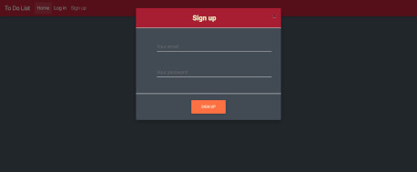
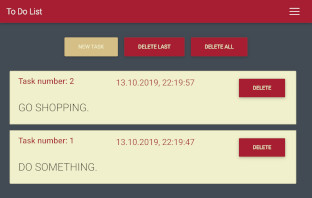
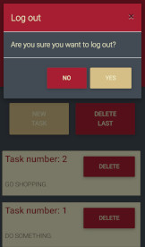

This project was bootstrapped with [Create React App](https://github.com/facebook/create-react-app).

# To Do List
> Hi everyone! This is my To Do List.

## Live
https://to-do-list-js.netlify.com/

## Technologies:
* Html
* Css
* Java Script
* Firebase
* MDBootstrap
* Sass

## General info
In this app you can add tasks. You can also delete last task, all tasks and task selected by you.
The data is saved at Firebase. 

## Screenshots

## Contact
Created by [lubiankamateusz@gmail.com] - feel free to contact me!